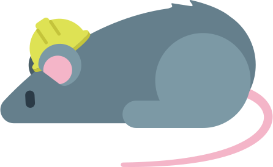
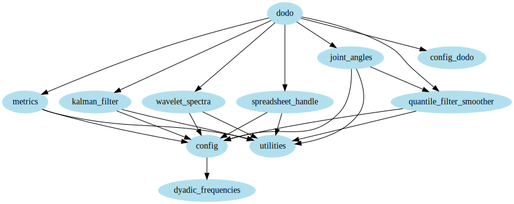

# animal-behavior-preprocessing

Neurobiology of Movement Lab, Medical Physics Department, Bariloche Atomic Centre, CNEA

## Introduction

`animal-behavior-preprocessing` is a Python repository to preprocess animal behavior data.
It works on the output spreadsheets from video-tracking of animal body parts with LEAP or DeepLabCut motion-tracking softwares.
It then applies a median filter, an ensemble Kalman filter, transforms data to joint angles and computes their Morlet wavelet spectra.
Thus, it extracts the featuresto be fed into adimensionality reduction algorithm, like UMAP or t-SNE, in order to produce behavioral maps (ethograms).

This repository was designed to be integrated with [`animal-behavior-analysis`](https://github.com/alvaro-concha/animal-behavior-analysis).
`animal-behavior-preprocessing` is the preparatory step, before using `animal-behavior-analysis`.
Both repositories are configured and optimized for analysing mouse behavior motion-tracking data, during the performance of accelerating rotarod tasks, recorded using both a frontal and a back camera, simultaneously.

`animal-behavior-preprocessing` is an implementation of a pipeline that runs several tasks.
To do this, we use [`doit`](https://pydoit.org/), a Python package that functions as a build-system tool, similar to [`make`](https://blogs.aalto.fi/marijn/2016/02/25/doit-a-python-alternative-to-make/), but with Python syntax!.
This build-system watches and keeps track of changes in files ("inputs and outputs", also known as "dependencies and targets", in build-system lingo) used by each task in the pipeline.
In this way, it makes it easier to keep files up-to-date, when tweaking different aspects of the pipeline (like modifying parameters, adding or removing tasks, etc.).
The build-system also figures out which tasks can be run in parallel, if a multi-core CPU is available.
 

Modules in `animal-behavior-preprocessing` and their import structure. An arrow from `module_a` to `module_b` indicates that `module_a` is importing `module_b`. The `dodo` module is the main module of the pipeline, and is named this way to conform with `doit` naming conventions.

## Instalation

In a terminal, run:

    git clone
    pip3 install -e git+http://github.com/alvaro-concha/animal-behavior-preprocessing.git#egg=AnimalBehaviorPreprocessing

### Organization of the  project

The project has the following structure:

    animal-behavior-preprocessing/
      |- LICENSE.md
      |- logo.svg
      |- module_imports.svg
      |- README.md
      |- requirements.txt
      |- setup.py
      |- animal\_behavior\_preprocessing/
         |- config.py
         |- config_dodo.py
         |- dodo.py
         |- dyadic_frequencies.py
         |- joint_angles.py
         |- kalman_filter.py
         |- metrics.py
         |- quantile_filter_smoother.py
         |- spreadsheet_handle.py
         |- utilities.py
         |- wavelet_spectra.py
